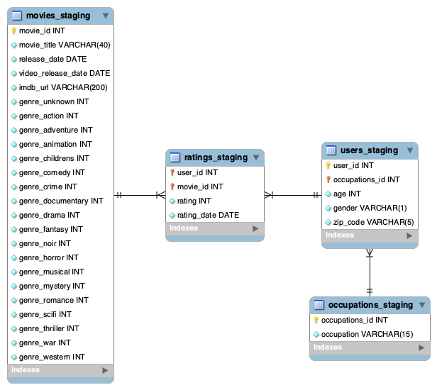
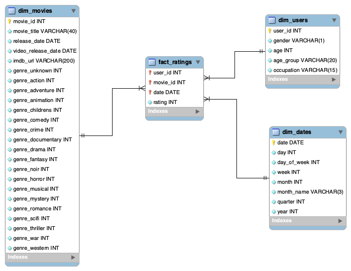

# ETL proces datasetu MovieLens
Tento repozitár obsahuje realizáciu ETL procesu pre analýzu dát z datasetu MovieLens. Proces zahŕňa kroky na extrakciu, transformáciu a načítanie údajov do dimenzionálneho modelu v Snowflake. Tento model je navrhnutý tak, aby umožňoval vizualizáciu a analýzu filmov, používateľov a ich hodnotení.
## 1. Úvod a popis zdrojových dát
Hlavným cieľom tohto semestrálneho projektu je preskúmať dáta súvisiace s filmami, používateľmi a ich hodnoteniami. Analýza pomáha odhaliť trendy v diváckych preferenciách, najobľúbenejšie filmy a vzorce správania používateľov. Odkaz na DB nájdete [tu](https://grouplens.org/datasets/movielens/).
### Zdrojove data:
- `movies`
- `occupations`
- `ratings`
- `users`
### 1.1 Dátová architektúra
#### ERD diagram MovieLens:

## 2. Dimenzionálny model
Bol vytvorený hviezdicový model (star schema), v ktorom je centrálnou tabuľkou faktov tabuľka `fact_ratings`, ku ktorej sú pripojené ďalšie dimenzie:

- `dim_dates`: dátumy hodnotení.
- `dim_movies`: názvy filmov.
- `dim_users`: údaje o používateľoch.

Vizualizácia štruktúry schémy je uvedená nižšie:

## 3. ETL proces v Snowflake
ETL proces zahŕňal tri kľúčové etapy: extrakciu (Extract), transformáciu (Transform) a načítanie (Load). Tento postup bol realizovaný v Snowflake s cieľom spracovať zdrojové dáta zo staging vrstvy a pripraviť ich na využitie v dimenzionálnom modeli určenom na analýzu a vizualizáciu.
### 3.1 Extract
#### 1. Vytvorenie tabuľky:
```sql
CREATE OR REPLACE TABLE ratings_staging (
    user_id INT,
    movie_id INT, 
    rating INT,
    rating_date timestamp
);
```
#### 2. Importovanie dát:
```sql
TRUNCATE TABLE ratings_staging;
COPY INTO ratings_staging
FROM @my_stage/ratings.csv
FILE_FORMAT = (TYPE = 'CSV' FIELD_DELIMITER = '\t' FIELD_OPTIONALLY_ENCLOSED_BY = '"' SKIP_HEADER = 0)
ON_ERROR = 'CONTINUE';
```
#### 3. Kontrola správneho fungovania:
```sql
SELECT * FROM ratings_staging;
```
To isté musíte urobiť so všetkými tabuľkami.
### 3.2 Transform & Load
Prvým krokom je vytvorenie dimenzie:
- `dim_users` - Verejná tabuľka uchovávajúca údaje používateľa. Obsahuje informácie o vekových kategóriách.
**Typ dimenzii: SCD0**
```sql
CREATE OR REPLACE TABLE public.dim_users AS
SELECT DISTINCT
    u.user_id,
    u.gender,
    u.age,
    CASE WHEN u.age < 16 THEN '0-15'
        WHEN u.age BETWEEN 16 AND 19 THEN '16-19'
        WHEN u.age BETWEEN 20 AND 29 THEN '20-29'
        WHEN u.age BETWEEN 30 AND 39 THEN '30-39'
        WHEN u.age BETWEEN 40 AND 49 THEN '40-49'
        WHEN u.age BETWEEN 50 AND 59 THEN '50-59'
        WHEN u.age >= 60 THEN '60+'
        ELSE 'Unknown' END AS age_group,
    o.occupation
FROM staging.users_staging u
JOIN staging.occupations_staging o ON u.occupation = o.occupation_id;
```
- `dim_movies` - Verejná tabuľka, v ktorej sú uložené všetky filmové žánre.
**Typ dimenzii: SCD0**
```sql
CREATE OR REPLACE TABLE public.dim_movies AS
SELECT DISTINCT
    MOVIE_ID AS ID,
    MOVIE_TITLE AS TITLE,          
    RELEASE_DATE AS RELEASED, 
    GENRE_ACTION,
    GENRE_ADVENTURE,
    GENRE_ANIMATION,
    GENRE_CHILDRENS,
    GENRE_COMEDY,
    GENRE_CRIME,
    GENRE_DOCUMENTARY,
    GENRE_DRAMA,
    GENRE_FANTASY,
    GENRE_NOIR,
    GENRE_HORROR,
    GENRE_MUSICAL,
    GENRE_MYSTERY,
    GENRE_ROMANCE,
    GENRE_SCIFI,
    GENRE_THRILLER,
    GENRE_WAR,
    GENRE_WESTERN
FROM staging.movies_staging;
```
- `fact_ratings` - Verejná stredová tabuľka hviezdnej mapy.
**Typ dimenzii: SCD0**
```sql
CREATE OR REPLACE TABLE PUBLIC.FACT_RATINGS AS
SELECT 
    R.USER_ID,
    R.MOVIE_ID,   
    R.RATING,                   
    R.RATING_DATE
FROM STAGING.RATINGS_STAGING R;
```
- `dim_dates` - Verejná tabuľka, v ktorej sú uložené dátumy hodnotení.
**Typ dimenzii: SCD0**
```sql
CREATE OR REPLACE TABLE PUBLIC.DIM_DATES AS
SELECT DISTINCT
    RATING_DATE AS DDATE,
    DATE_PART(day, RATING_DATE) AS DAY,       
    DATE_PART(dow, RATING_DATE) + 1 AS DAY_OF_WEEK,
    DATE_PART(week, RATING_DATE) AS WEEK,
    DATE_PART(month, RATING_DATE) AS MONTH,              
    CASE DATE_PART(month, RATING_DATE)
        WHEN 1 THEN 'JAN'
        WHEN 2 THEN 'FEB'
        WHEN 3 THEN 'MAR'
        WHEN 4 THEN 'APR'
        WHEN 5 THEN 'MAY'
        WHEN 6 THEN 'JUN'
        WHEN 7 THEN 'JUL'
        WHEN 8 THEN 'AUG'
        WHEN 9 THEN 'SEP'
        WHEN 10 THEN 'OCT'
        WHEN 11 THEN 'NOV'
        WHEN 12 THEN 'DEC'
    END AS MONTH_NAME,
    DATE_PART(quarter, RATING_DATE) AS QUARTER,
    DATE_PART(year, RATING_DATE) AS YEAR
FROM STAGING.RATINGS_STAGING
GROUP BY RATING_DATE, 
    DATE_PART(day, RATING_DATE), 
    DATE_PART(dow, RATING_DATE), 
    DATE_PART(month, RATING_DATE), 
    DATE_PART(year, RATING_DATE), 
    DATE_PART(week, RATING_DATE), 
    DATE_PART(quarter, RATING_DATE);
```
Ďalej vytvoríme žánrový rebríček(?):
```sql
CREATE OR REPLACE VIEW PUBLIC.RATINGS_BY_GENRE_VIEW AS
SELECT 
    GENRE_NAME, 
    AVG_RATING,
    CNT_RATING 
FROM (
    SELECT 'Action'      AS GENRE_NAME, AVG(RATING) AS AVG_RATING, COUNT(RATING) AS CNT_RATING FROM FACT_RATINGS FR JOIN DIM_MOVIES DM ON FR.MOVIE_ID = DM.ID AND DM.GENRE_ACTION = 1 UNION ALL
    SELECT 'Adventure'   AS GENRE_NAME, AVG(RATING) AS AVG_RATING, COUNT(RATING) AS CNT_RATING FROM FACT_RATINGS FR JOIN DIM_MOVIES DM ON FR.MOVIE_ID = DM.ID AND DM.GENRE_ADVENTURE = 1 UNION ALL
    SELECT 'Animation'   AS GENRE_NAME, AVG(RATING) AS AVG_RATING, COUNT(RATING) AS CNT_RATING FROM FACT_RATINGS FR JOIN DIM_MOVIES DM ON FR.MOVIE_ID = DM.ID AND DM.GENRE_ANIMATION = 1 UNION ALL
    SELECT 'Children'    AS GENRE_NAME, AVG(RATING) AS AVG_RATING, COUNT(RATING) AS CNT_RATING FROM FACT_RATINGS FR JOIN DIM_MOVIES DM ON FR.MOVIE_ID = DM.ID AND DM.GENRE_CHILDRENS = 1 UNION ALL
    SELECT 'Comedy'      AS GENRE_NAME, AVG(RATING) AS AVG_RATING, COUNT(RATING) AS CNT_RATING FROM FACT_RATINGS FR JOIN DIM_MOVIES DM ON FR.MOVIE_ID = DM.ID AND DM.GENRE_COMEDY = 1 UNION ALL
    SELECT 'Crime'       AS GENRE_NAME, AVG(RATING) AS AVG_RATING, COUNT(RATING) AS CNT_RATING FROM FACT_RATINGS FR JOIN DIM_MOVIES DM ON FR.MOVIE_ID = DM.ID AND DM.GENRE_CRIME = 1 UNION ALL
    SELECT 'Documentary' AS GENRE_NAME, AVG(RATING) AS AVG_RATING, COUNT(RATING) AS CNT_RATING FROM FACT_RATINGS FR JOIN DIM_MOVIES DM ON FR.MOVIE_ID = DM.ID AND DM.GENRE_DOCUMENTARY = 1 UNION ALL
    SELECT 'Drama'       AS GENRE_NAME, AVG(RATING) AS AVG_RATING, COUNT(RATING) AS CNT_RATING FROM FACT_RATINGS FR JOIN DIM_MOVIES DM ON FR.MOVIE_ID = DM.ID AND DM.GENRE_DRAMA = 1 UNION ALL
    SELECT 'Fantasy'     AS GENRE_NAME, AVG(RATING) AS AVG_RATING, COUNT(RATING) AS CNT_RATING FROM FACT_RATINGS FR JOIN DIM_MOVIES DM ON FR.MOVIE_ID = DM.ID AND DM.GENRE_FANTASY = 1 UNION ALL
    SELECT 'FilmNoir,'   AS GENRE_NAME, AVG(RATING) AS AVG_RATING, COUNT(RATING) AS CNT_RATING FROM FACT_RATINGS FR JOIN DIM_MOVIES DM ON FR.MOVIE_ID = DM.ID AND DM.GENRE_NOIR = 1 UNION ALL
    SELECT 'Horror'      AS GENRE_NAME, AVG(RATING) AS AVG_RATING, COUNT(RATING) AS CNT_RATING FROM FACT_RATINGS FR JOIN DIM_MOVIES DM ON FR.MOVIE_ID = DM.ID AND DM.GENRE_HORROR = 1 UNION ALL
    SELECT 'Musical'     AS GENRE_NAME, AVG(RATING) AS AVG_RATING, COUNT(RATING) AS CNT_RATING FROM FACT_RATINGS FR JOIN DIM_MOVIES DM ON FR.MOVIE_ID = DM.ID AND DM.GENRE_MUSICAL = 1 UNION ALL
    SELECT 'Mystery'     AS GENRE_NAME, AVG(RATING) AS AVG_RATING, COUNT(RATING) AS CNT_RATING FROM FACT_RATINGS FR JOIN DIM_MOVIES DM ON FR.MOVIE_ID = DM.ID AND DM.GENRE_MYSTERY = 1 UNION ALL
    SELECT 'Romance'     AS GENRE_NAME, AVG(RATING) AS AVG_RATING, COUNT(RATING) AS CNT_RATING FROM FACT_RATINGS FR JOIN DIM_MOVIES DM ON FR.MOVIE_ID = DM.ID AND DM.GENRE_ROMANCE = 1 UNION ALL
    SELECT 'SciFi,'      AS GENRE_NAME, AVG(RATING) AS AVG_RATING, COUNT(RATING) AS CNT_RATING FROM FACT_RATINGS FR JOIN DIM_MOVIES DM ON FR.MOVIE_ID = DM.ID AND DM.GENRE_SCIFI = 1 UNION ALL
    SELECT 'Thriller'    AS GENRE_NAME, AVG(RATING) AS AVG_RATING, COUNT(RATING) AS CNT_RATING FROM FACT_RATINGS FR JOIN DIM_MOVIES DM ON FR.MOVIE_ID = DM.ID AND DM.GENRE_THRILLER = 1 UNION ALL
    SELECT 'War'         AS GENRE_NAME, AVG(RATING) AS AVG_RATING, COUNT(RATING) AS CNT_RATING FROM FACT_RATINGS FR JOIN DIM_MOVIES DM ON FR.MOVIE_ID = DM.ID AND DM.GENRE_WAR = 1 UNION ALL
    SELECT 'Western'     AS GENRE_NAME, AVG(RATING) AS AVG_RATING, COUNT(RATING) AS CNT_RATING FROM FACT_RATINGS FR JOIN DIM_MOVIES DM ON FR.MOVIE_ID = DM.ID AND DM.GENRE_WESTERN = 1
)
ORDER BY GENRE_NAME;
```
Po vytvorení dimenzií a faktovej tabuľky boli údaje úspešne načítané do týchto tabuliek. Následne sa staging tabulky odstránili, aby sa optimalizovalo využitie úložného priestoru.
```sql
DROP TABLE IF EXISTS staging.ratings_staging;
DROP TABLE IF EXISTS staging.movies_staging;
DROP TABLE IF EXISTS staging.users_staging;
DROP TABLE IF EXISTS staging.occupations_staging;
```
## 4 Vizualizácia dát
